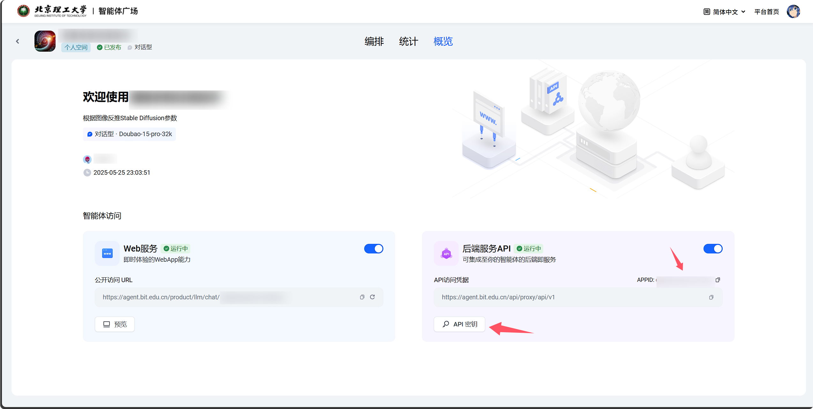

# Agent API

将北京理工大学的 [agent.bit.edu.cn](https://agent.bit.edu.cn) 封装成一个 OpenAI 风格的 API。

来源是自己安卓大作业里实在懒得再写一份调用 `agent.bit.edu.cn` 的代码，所以就封装成 `OpenAI` 风格的 API 了。

本文档和项目基本完全由 cursor 生成，但这句话不是。

[](https://python.org)
[](https://fastapi.tiangolo.com)
[](https://docker.com)
[](LICENSE)


## 📁 项目结构

```
open-agent-api/
├── app/                    # 应用程序主目录
│   ├── api/               # API 路由层
│   │   └── endpoints/     # API 端点
│   ├── core/              # 核心模块
│   │   ├── config.py      # 配置管理
│   │   └── auth.py        # 认证模块
│   ├── models/            # 数据模型
│   ├── services/          # 业务服务层
│   └── utils/             # 工具函数
├── tests/                 # 测试套件
│   ├── test_client.py     # 功能测试
│   ├── debug_api.py       # 调试工具
│   └── run_tests.py       # 测试运行器
├── main.py                # 应用入口
├── requirements.txt       # Python 依赖
├── Dockerfile             # Docker 镜像
├── docker-compose.yml     # Docker 编排
└── config.yaml            # 默认配置
```

## 🚀 快速开始

### 方式一：本地运行

1. **克隆项目**
```bash
git clone <repository-url>
cd open-agent-api
```

2. **安装依赖**
```bash
pip install -r requirements.txt
```

3. **配置服务**

需要启用服务，并获取 `app_id` 和 `api_key` 参数。



```bash
# 复制配置文件
cp config.local.yaml.example config.local.yaml

# 编辑配置文件，填入您的 Agent API 配置
# config.local.yaml
agent:
  app_id: "your_app_id"
  api_key: "your_api_key"
```

4. **启动服务**
```bash
python main.py
```

### 方式二：Docker 部署（推荐）

1. **准备配置**
```bash
# 复制环境变量文件
cp env.example .env

# 编辑 .env 文件
AGENT_APP_ID=your_app_id
AGENT_API_KEY=your_api_key
```

2. **启动服务**
```bash
docker-compose up -d
```

3. **查看状态**
```bash
# 查看服务状态
docker-compose ps

# 查看日志
docker-compose logs -f
```

## 🔧 配置说明

### 配置方式

支持两种配置方式，**环境变量优先级更高**：

#### 1. 配置文件（推荐开发环境）
```yaml
# config.local.yaml
agent:
  api_base_url: "https://agent.bit.edu.cn"
  app_id: "your_app_id"
  api_key: "your_api_key"

server:
  host: "0.0.0.0"
  port: 8000
  auth_key: ""  # 可选：API 认证密钥

session:
  max_conversations: 1000
  timeout: 3600

logging:
  level: "INFO"
  verbose: false
```

#### 2. 环境变量（推荐生产环境）
```bash
# 必需配置
AGENT_APP_ID=your_app_id
AGENT_API_KEY=your_api_key

# 可选配置
AGENT_API_BASE_URL=https://agent.bit.edu.cn
SERVER_HOST=0.0.0.0
SERVER_PORT=8000
API_AUTH_KEY=your_auth_key
MAX_CONVERSATIONS=1000
CONVERSATION_TIMEOUT=3600
LOG_LEVEL=INFO
VERBOSE_LOGGING=false
```

### 配置项说明

| 配置项 | 环境变量 | 必需 | 默认值 | 说明 |
|--------|----------|------|--------|------|
| agent.app_id | AGENT_APP_ID | ✅ | - | Agent 应用 ID |
| agent.api_key | AGENT_API_KEY | ✅ | - | Agent API 密钥 |
| agent.api_base_url | AGENT_API_BASE_URL | ❌ | https://agent.bit.edu.cn | Agent API 基础 URL |
| server.host | SERVER_HOST | ❌ | 0.0.0.0 | 服务器监听地址 |
| server.port | SERVER_PORT | ❌ | 8000 | 服务器端口 |
| server.auth_key | API_AUTH_KEY | ❌ | "" | API 认证密钥 |

## 📡 API 使用

### 获取模型列表
```bash
curl http://localhost:8000/v1/models
```

### 聊天完成（非流式）
```bash
curl -X POST http://localhost:8000/v1/chat/completions \
  -H "Content-Type: application/json" \
  -d '{
    "model": "agent-model",
    "messages": [
      {"role": "user", "content": "你好，请介绍一下你自己"}
    ]
  }'
```

### 聊天完成（流式）
```bash
curl -X POST http://localhost:8000/v1/chat/completions \
  -H "Content-Type: application/json" \
  -d '{
    "model": "agent-model",
    "messages": [
      {"role": "user", "content": "写一首关于春天的诗"}
    ],
    "stream": true
  }'
```

### 使用认证
如果启用了 API 认证，需要在请求头中添加：
```bash
curl -X POST http://localhost:8000/v1/chat/completions \
  -H "Content-Type: application/json" \
  -H "Authorization: Bearer your_auth_key" \
  -d '{"model": "agent-model", "messages": [...]}'
```

## 🧪 测试

### 运行所有测试
```bash
cd tests
python run_tests.py
```

### 交互式测试
```bash
cd tests
python run_tests.py --interactive
```

### 单独运行测试
```bash
cd tests
python test_client.py      # 完整功能测试
python test_config.py      # 配置系统测试
python simple_test.py      # 快速连接测试
python debug_api.py        # API 调试工具
```

## 🐳 Docker 部署

### 基本部署
```bash
# 使用 Docker Compose（推荐）
docker-compose up -d

# 或使用 Docker 命令
docker build -t agent-api .
docker run -d --name agent-api -p 8000:8000 --env-file .env agent-api
```

### 生产部署
```bash
# 创建生产配置
cp docker-compose.yml docker-compose.prod.yml

# 编辑生产配置，调整资源限制等
# 启动生产服务
docker-compose -f docker-compose.prod.yml up -d
```

详细的 Docker 部署说明请参考 [DOCKER.md](DOCKER.md)。

## 🔍 健康检查

### 内置端点
- **根路径**: `GET /` - 服务信息
- **健康检查**: `GET /health` - 服务健康状态
- **统计信息**: `GET /stats` - 会话统计信息

### 监控示例
```bash
# 检查服务状态
curl http://localhost:8000/health

# 查看统计信息
curl http://localhost:8000/stats

# 获取服务信息
curl http://localhost:8000/
```

## 🛠️ 开发

### 开发环境设置
```bash
# 克隆项目
git clone <repository-url>
cd open-agent-api

# 创建虚拟环境
python -m venv venv
source venv/bin/activate  # Linux/Mac
# 或
venv\Scripts\activate     # Windows

# 安装依赖
pip install -r requirements.txt

# 配置开发环境
cp config.yaml config.local.yaml
# 编辑 config.local.yaml 填入配置

# 启动开发服务器
python main.py
```

### 代码结构说明

- **`app/core/`**: 核心功能模块
  - `config.py`: 配置管理，支持多种配置源
  - `auth.py`: 认证和授权逻辑

- **`app/models/`**: 数据模型定义
  - `chat.py`: 聊天相关的 Pydantic 模型

- **`app/services/`**: 业务逻辑层
  - `agent_service.py`: Agent API 服务封装

- **`app/api/endpoints/`**: API 端点定义
  - `chat.py`: 聊天相关的 API 路由

### 添加新功能

1. **添加新的 API 端点**:
   - 在 `app/api/endpoints/` 中创建新文件
   - 在 `app/__init__.py` 中注册路由

2. **添加新的服务**:
   - 在 `app/services/` 中创建服务类
   - 在相应的端点中使用服务

3. **添加新的模型**:
   - 在 `app/models/` 中定义 Pydantic 模型
   - 在 API 端点中使用模型进行验证

## 🔧 故障排除

### 常见问题

#### 1. 配置错误
```bash
# 检查配置加载
cd tests && python test_config.py

# 查看当前配置
python -c "from app.core.config import settings; print(settings)"
```

#### 2. 连接问题
```bash
# 测试基本连接
cd tests && python simple_test.py

# 调试 API 接口
cd tests && python debug_api.py
```

#### 3. Docker 问题
```bash
# 查看容器日志
docker-compose logs -f agent-api

# 检查容器状态
docker-compose ps

# 进入容器调试
docker-compose exec agent-api bash
```

### 调试建议

1. **启用详细日志**:
   ```bash
   export LOG_LEVEL=DEBUG
   export VERBOSE_LOGGING=true
   ```

2. **使用调试工具**:
   ```bash
   cd tests && python debug_api.py
   ```

3. **检查配置优先级**:
   ```bash
   cd tests && python test_config.py
   ```

## 📚 API 文档

启动服务后，可以访问自动生成的 API 文档：

- **Swagger UI**: http://localhost:8000/docs
- **ReDoc**: http://localhost:8000/redoc

### 开发规范

- 遵循 PEP 8 代码风格
- 添加适当的类型注解
- 为新功能编写测试
- 更新相关文档

## 📄 许可证

本项目采用 MIT 许可证。详见 [LICENSE](LICENSE) 文件。

---

## 🤝 致谢

- [Decent898/live2d-project-for-HCI](https://github.com/Decent898/live2d-project-for-HCI) 和 [YDX-2147483647/faq-bot](https://github.com/YDX-2147483647/faq-bot) 里提供的调用 `HiAgent` 的代码和文档，给了我很大的启发。
- [yht0511/open_ibit](https://github.com/yht0511/open_ibit) 里提供的实现 `OpenAI` 风格的 API 的代码，给了我很大的启发。
- cursor and Claude 4 

